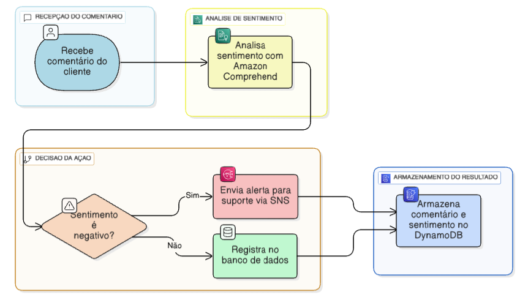

# Desafio 2 - Explorando Workflows Automatizados com AWS Step Functions

Nesse desafio, foi solicitado que eu registrasse os aprendizados das aulas e desenvolvesse uma aplicação prática para reforçar o conteúdo. Escolhi simular um cenário com AWS Step Functions, o que me ajudou a entender melhor como orquestrar serviços, tomar decisões automatizadas e integrar recursos como Lambda, Comprehend, SNS e DynamoDB.

## ✨️ Cenário: Classificação de Sentimentos em Comentários

Simulação de um fluxo automatizado que analisa sentimentos em comentários de clientes usando AWS Step Functions. O objetivo é classificar os comentários como positivos, neutros ou negativos e tomar ações com base no resultado.

---

## 🎯 Objetivo 

Criar um workflow que receba um comentário, analise o sentimento com Amazon Comprehend, decida o que fazer com base no resultado e registre tudo em um banco de dados. Se o sentimento for negativo, o sistema envia um alerta para a equipe de suporte.

---

## 📍Etapas do Workflow 
1. Recebe o comentário do cliente
2. Analisa sentimento com Amazon Comprehend
3. Decidi ação, com Choice State, com base no sentimento:
- Se for negativo, envia alerta para o suporte via SNS
- Se positivo ou neutro, apenas registra no banco 
4. Armazena o resultado (comentário + sentimento) no DynamoDB

Exemplo:
O cliente comenta: “O atendimento não me agradou, muito demorado.” O sistema recebe esse comentário e uma função Lambda o envia para o Amazon Comprehend, que analisa o sentimento envolvido e retorna uma classificação — neste caso, negativa. Com base nesse resultado, o fluxo envia um alerta via SNS para a equipe de suporte para que o problema seja resolvido. Por fim, o comentário e o sentimento classificado são armazenados em uma tabela do DynamoDB para consulta futura.

---

## 📁 Diagrama do Workflow

---

## ☁️ Serviços AWS envolvidos

- AWS Step Functions: orquestra o fluxo e define a lógica condicional.
- Amazon Comprehend: realiza a análise de sentimento.
- AWS Lambda: executa funções como enviar o texto para análise, enviar alerta e salvar dados.
- Amazon SNS: envia notificações em caso de sentimento negativo.
- Amazon DynamoDB: armazena os comentários e os resultados da análise.

---

## 📝 Aprendizados

- Como usar o Amazon Comprehend para análise de texto.
- Como integrar Amazon Comprehend com Step Functions.
- Uso de Choice States para lógica condicional.
- Como integrar Lambda com serviços como SNS e DynamoDB.
- Armazenamento de resultados com DynamoDB.
